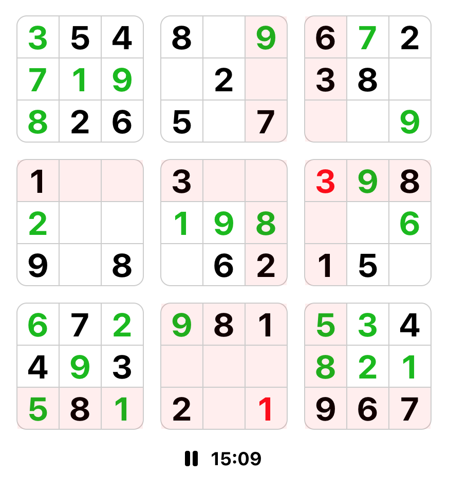

# Sudoku in React
This project is a Sudoku game made in React. The objective of Sudoku is to fill a partially complete puzzle grid in such a way that each row, column, and subgrid contains all numbers from 1 to 9. There are four difficulties: easy, medium, hard, and evil. There is a set number of maximum mistakes allowed called "lives". If the player makes too many mistakes the game is lost.

## Project setup
1. Run ```npm install``` to bring in all the necessary dependencies
2. Rum ```npm start``` to launch the project

